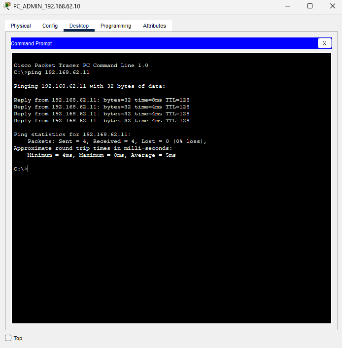
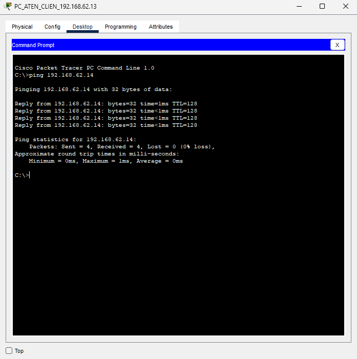
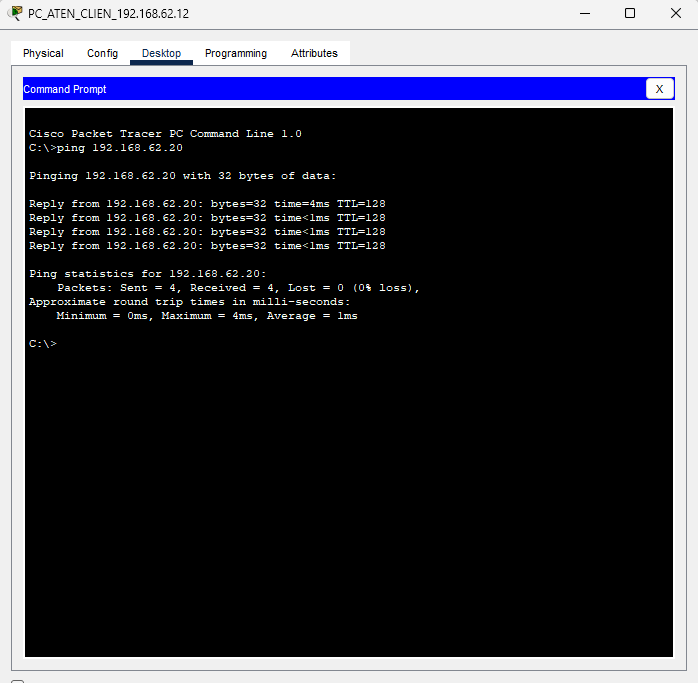
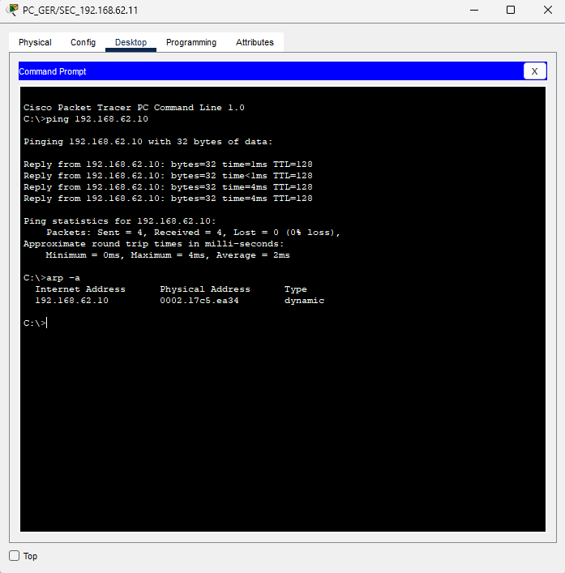

# Manual Tecnico

## Introducción

Introducción al Manual Técnico

Este manual proporciona el resultado de una serie de instrucciones concisas para configurar una red local empresarial pequeña en Packet Tracer.

## Resultados

