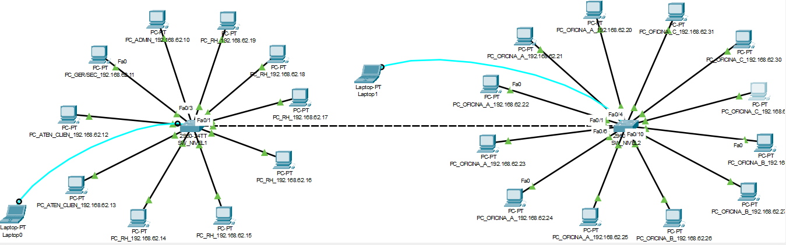
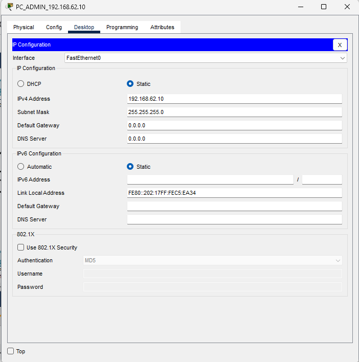
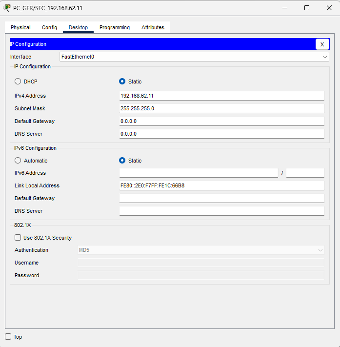
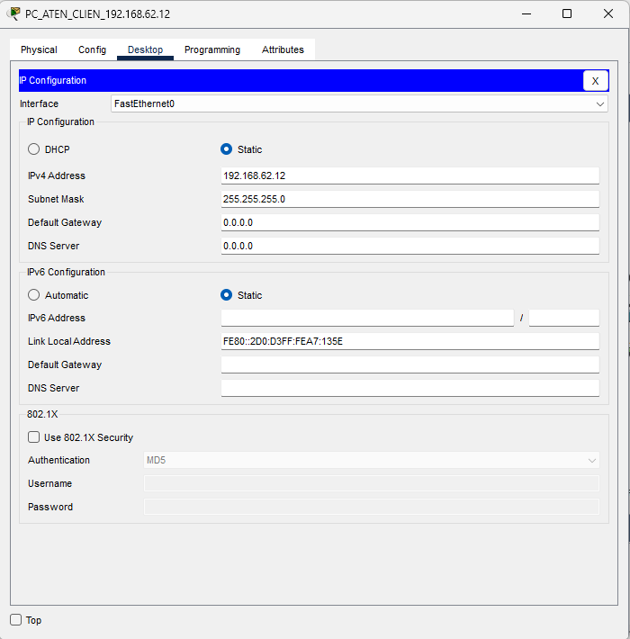
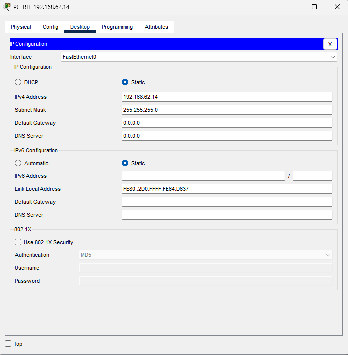
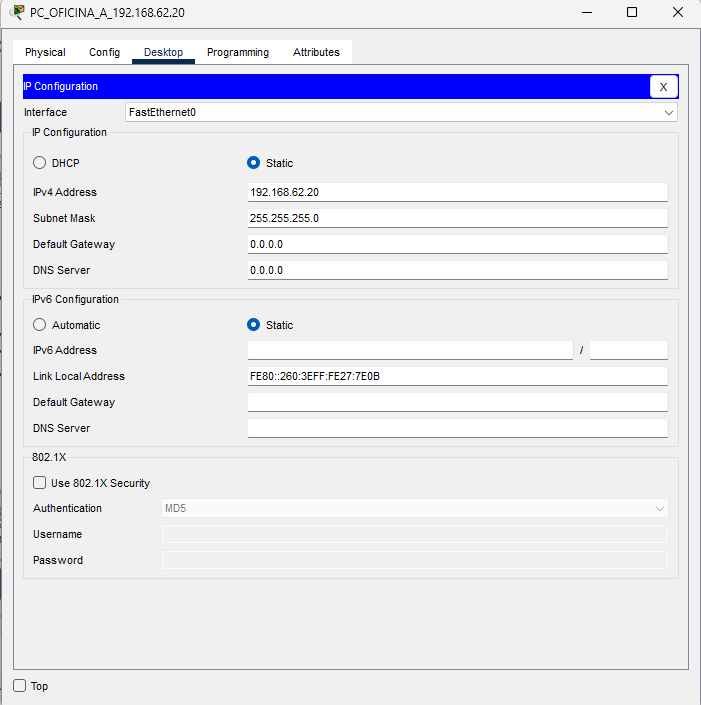
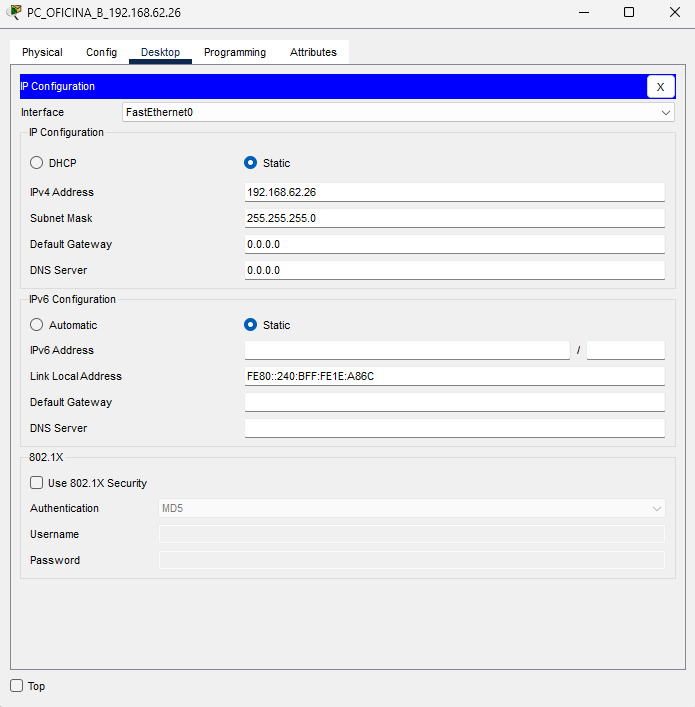
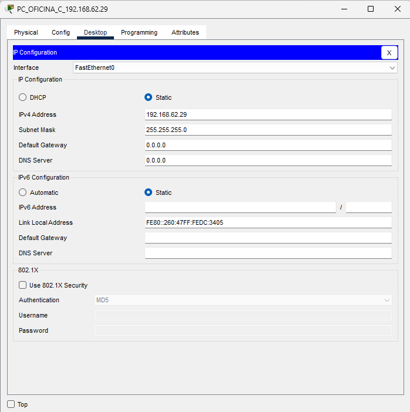

# Manual Tecnico

## Introducción 📝

Este manual presenta los resultados obtenidos de la practica 1 del curso redes de computadoras 1, la cual se enfoca en la configuración de una red local empresarial de pequeña escala utilizando la plataforma Packet Tracer.

## Objetivo 📈

El objetivo principal de este manual es familiarizar a los usuarios con los conceptos básicos de diseño y configuración de redes locales empresariales a través de una práctica realizada en Packet Tracer. 

## Conocimientos Previo💡

Los conocimientos mínimos que deben tener las personas que operarán las páginas y deberán utilizar este manual son:

* Conocimientos respecto a los protocolos Ethernet, IP, ARP e ICMP.
* Conocimiento en configuración de máquinas virtuales VPC y switches de capa 2.
* Manejo en programa de simulacion de redes (Packet Tracer).

## Resultados ✅

A continuacion se mostraran capturas de pantallas de los resultados obtenidos al momento de ejecutar la simulacion de una red local pequeña en Packet Tracer.

### Topologia

Topologia de la red.

### Configuracion de las VPC

La imagen anterior representa la configuracion de la VPC perteneciente al nivel 1, area de administracion.

La imagen anterior representa la configuracion de la VPC perteneciente al nivel 1, area de gerencia/secretaria.

La imagen anterior representa la configuracion de la VPC perteneciente al nivel 1, area de antecion al cliente.

La imagen anterior representa la configuracion de la VPC perteneciente al nivel 1, area de recursos humanos.

La imagen anterior representa la configuracion de la VPC perteneciente al nivel 2, area de oficina A.

La imagen anterior representa la configuracion de la VPC perteneciente al nivel 2, area de oficina B.

La imagen anterior representa la configuracion de la VPC perteneciente al nivel 2, area de oficina C.

### Ping entre los Hosts

La imagen anterior representa el ping realizado de la VPC 192.168.62.10 (nivel 1, administracion) a la VPC 192.168.62.11 (nivel 1, gerencia/secretaria).

La imagen anterior representa el ping realizado de la VPC 192.168.62.13 (nivel 1, atencion al cliente) a la VPC 192.168.62.14 (nivel 1, recursos humanos).

La imagen anterior representa el ping realizado de la VPC 192.168.62.12 (nivel 1, atencion al cliente) a la VPC 192.168.62.20 (nivel 2, oficina A).

### Paquete ARP/ICMP

La imagen anterior representa la captura de un paquete ARP.

## Construido con 🛠

Para la creacion de la practica se utilizaron los siguientes programas de simulacion de redes:

* [Packet Tracer](https://www.netacad.com/es/courses/packet-tracer) - Usado para la creacion total de la practica.

## Autor ✒

* [Pedro Luis Pu Tavico](https://github.com/luis-tavico)