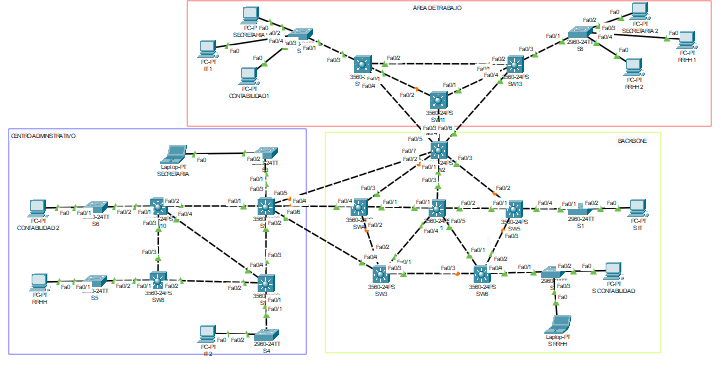
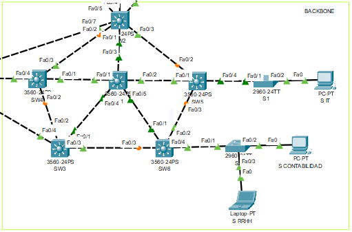
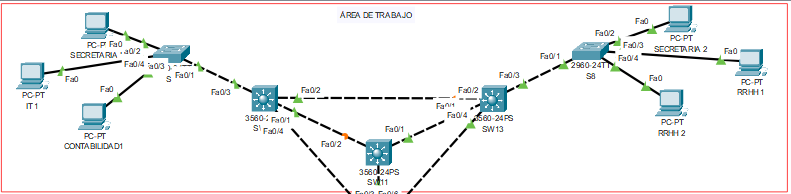
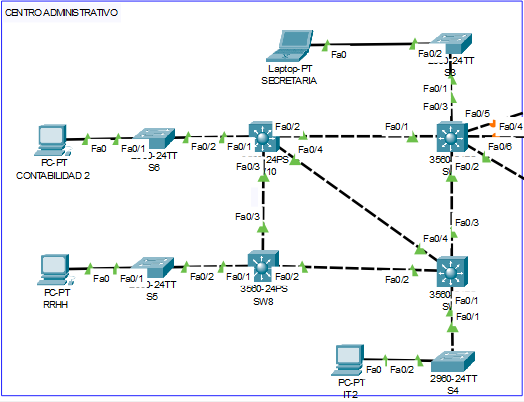
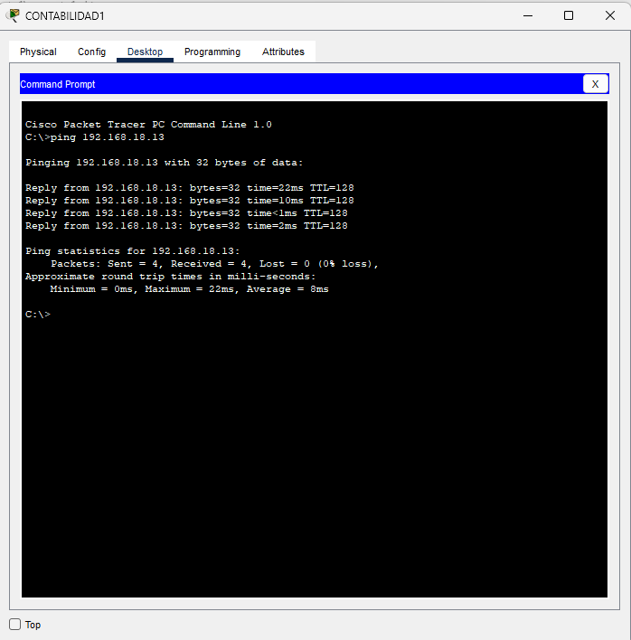
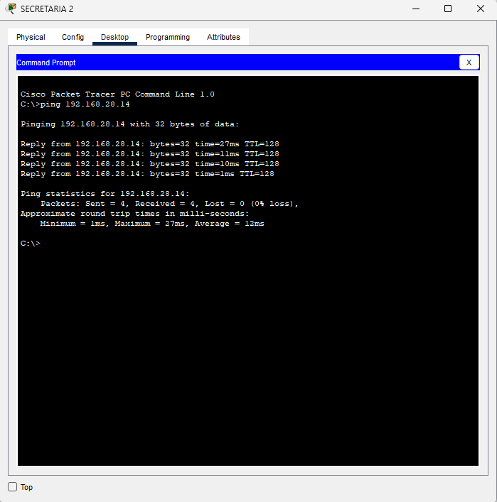

# Manual Tecnico

## Introducción 📝

Este manual presenta los resultados obtenidos del proyecto 1 del curso redes de computadoras 1, la cual se enfoca en la configuración de una red local empresarial de pequeña escala utilizando la plataforma Packet Tracer.

## Objetivo 📈

El objetivo principal de este manual es familiarizar a los usuarios con los conceptos básicos de diseño y configuración de redes locales empresariales a través de un proyecto realizada en Packet Tracer. 

## Conocimientos Previo💡

Los conocimientos mínimos que deben tener las personas que operarán las páginas y deberán utilizar este manual son:

* Conocimientos respecto a los protocolos Ethernet, IP, ARP e ICMP.
* Conocimientos sobre VLANS y protocolo VTP.
* Conocimientos sobre redundancia y prevencion de bucles en la red garantizado por Spanning Tree Protocol.
* Conocimiento en configuración de máquinas virtuales VPC y switches de capa 2.
* Manejo en programa de simulacion de redes (Packet Tracer).

## Direcciones IP y VLAN 🖥️

### IPs

Tabla de direcciones ip asignadas a cada pc pertenecientes a cada departamento.

| Area                  | Departamento  | ID de Red     |
|-----------------------|---------------|---------------|
| Area de Trabajo       | Contabilidad1 | 192.168.18.12 |
| Area de Trabajo       | Secretaria1   | 192.168.28.12 |
| Area de Trabajo       | Secretaria2   | 192.168.28.13 |
| Area de Trabajo       | RRHH1         | 192.168.38.12 |
| Area de Trabajo       | RRHH2         | 192.168.38.13 |
| Area de Trabajo       | IT1           | 192.168.48.12 |
| Centro Administrativo | Contabilidad2 | 192.168.18.13 |
| Centro Administrativo | Secretaria    | 192.168.28.14 |
| Centro Administrativo | RRHH          | 192.168.38.14 |
| Centro Administrativo | IT2           | 192.168.48.13 |
| Backbone              | Contabilidad  | 192.168.18.11 |
| Backbone              | RRHH          | 192.168.38.11 |
| Backbone              | IT            | 192.168.48.11 |

### VLANs

Tabla de VLANs pertenecientes a cada departamento.

| Departamento | VLAN |
|--------------|------|
| Contabilidad | 18   |
| Secretaria   | 28   |
| RRHH         | 38   |
| IT           | 48   |

#### Centro Administrativo

## Topologias 🌐

A continuacion se muestran la topologia de la red completa.



### Backbone



### Area de Trabajo



### Centro Administrativo



## Comandos utilizados ⌨️

A continuacion se muestran los comandos utilizados para la configuracion de los switches SW1, SW5 y S1 .

### SW1 (Server)

Los siguientes comandos configuran el switch SW1 como Server y Root.

```
interface range fa0/1-5
```
Este comando selecciona un rango de interfaces FastEthernet, en este caso del 1 al 5 para su configuración.

```
switchport trunk encapsulation dot1q
```
Este comando configura la encapsulación de troncal en las interfaces seleccionadas utilizando el estándar 802.1Q.

```
switchport mode trunk
```
Este comando configura las interfaces seleccionadas en modo de troncal, lo que les permite transportar múltiples VLAN a través de ellas.

```
vlan 18
name contabilidad
vlan 28
name secretaria
vlan 38
name rrhh
vlan 48
name it
```
El comando vlan crea una VLAN con el numero de identificacion especificado y el comando name asigna un nombre descriptivo a la VLAN.

```
vtp version 2
```
Este comando establece la versión 2 del Protocolo de Tramas de VLAN (VTP), que es una forma de sincronizar información de VLAN entre switches.

```
vtp mode server
```
Este comando configura el dispositivo como un servidor VTP, lo que le permite gestionar y propagar información de VLAN a otros dispositivos VTP.

```
vtp domain P13
```
Este comando especifica el nombre de dominio VTP como "P13".

```
vtp password usac
```
Este comando establece una contraseña para el dominio VTP, lo que ayuda a asegurar la sincronización de la información de VLAN.

```
spanning-tree vlan 1 root primary
spanning-tree vlan 18 root primary
spanning-tree vlan 28 root primary
spanning-tree vlan 38 root primary
spanning-tree vlan 48 root primary
```
Estos comandos configuran el switch como el puente raíz primario para las VLANs especificadas, lo que optimiza la topología del árbol de expansión.

```
spanning-tree mode rapid-pvst
```
Este comando configura el switch para utilizar el modo Spanning Tree Protocol Rapid Per-VLAN Spanning Tree (Rapid-PVST), que proporciona una convergencia más rápida del árbol de expansión en entornos VLAN.

### SW5 (Client)

Los siguientes comandos configuran el switch SW5 como Client.

```
interface range fa0/1-4
```
Este comando selecciona un rango de interfaces FastEthernet del 1 al 4 para su configuración.

```
switchport trunk encapsulation dot1q
```
Configura la encapsulación de troncal en las interfaces seleccionadas utilizando el estándar 802.1Q.

```
switchport mode trunk
```
Configura las interfaces seleccionadas en modo de troncal.

```
vtp mode client
```
Este comando configura el dispositivo como un cliente VTP, lo que significa que sincronizará su información de VLAN con servidores VTP pero no propagará la información de VLAN a otros dispositivos.

```
vtp domain P13
```
Este comando especifica el nombre de dominio VTP como "P13".

```
vtp password usac
```
Este comando establece una contraseña para el dominio VTP.

### S1 (Client)

Los siguientes comandos configuran el switch S1 como Client y los puertos en modo access.

```
int f0/1
```
Este comando selecciona la interfaz FastEthernet 0/1 para su configuración.

```
switchport mode trunk
```
Este comando configura la interfaz seleccionada en modo de troncal, lo que le permite transportar múltiples VLAN a través de ella.

```
vtp mode client
```
Este comando configura el dispositivo como un cliente VTP, lo que significa que sincronizará su información de VLAN con servidores VTP pero no propagará la información de VLAN a otros dispositivos.

```
vtp domain P13
```
Este comando especifica el nombre de dominio VTP como "P13".

```
vtp password usac
```
Este comando establece una contraseña para el dominio VTP.

```
int f0/2
```
Este comando selecciona la interfaz FastEthernet 0/2 para su configuración.

```
switchport access vlan 48
```
Este comando configura la interfaz seleccionada para el acceso a la VLAN 48, lo que significa que todo el tráfico que pase por esta interfaz será asignado a la VLAN 48.

## Ping entre hosts 🔗



La imagen anterior representa el ping realizado de la VPC 192.168.18.12 (Contabilidad 1, Area de Trabajo) a la VPC 192.168.18.13 (Contabilidad 2, Centro Administrativo).



La imagen anterior representa el ping realizado de la VPC 192.168.28.13 (Secretaria 2, Area de Trabajo) a la VPC 192.168.28.14 (Secretaria, Area de Trabajo).

## Construido con 🛠

Para la creacion de la practica se utilizaron los siguientes programas de simulacion de redes:

* [Packet Tracer](https://www.netacad.com/es/courses/packet-tracer) - Usado para la creacion total de la practica.

## Autor ✒

* [Pedro Luis Pu Tavico](https://github.com/luis-tavico)